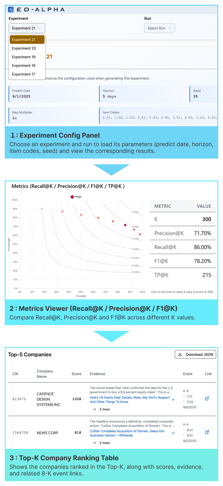

<p align="center">
  
</p>

<p align="center">
  
</p>

# ED-Alpha

ED-Alpha is a Python 3.12.11 pipeline that ingests SEC filings and GDELT news, links articles to companies, scores event importance with LLMs, and evaluates recall@k / precision@k against actual filing events. The project combines a batch data pipeline with a lightweight app UI.

## Overview

- Pipeline steps: (1) sync SEC company data and filings to build labels, (2) ingest GDELT GKG news and link them to companies, (3) score article importance with an LLM, (4) aggregate run-level scores to extract likely events and measure metrics.
- Tech stack: Python 3.12.11, PostgreSQL, OpenAI Chat Completions API, FastAPI app backend, Next.js/PNPM frontend.

<p align="center">
  
</p>

## Quickstart

Run the full stack with Docker Compose v2 (`docker compose …`): Postgres + backend (FastAPI) + frontend (Next.js) + batch runner.

### 1. Prepare environment

```bash
cp .env.sample .env
# Edit as needed
USER_EMAIL=you@example.com
PGHOST=localhost
PGPORT=5432
PGDATABASE=postgres
PGUSER=postgres
PGPASSWORD=postgres
PGSSL=disable
OPENROUTER_API_KEY=xxx        # only if you need it
NEXT_PUBLIC_API_BASE_URL=http://localhost:8000
```

### 2. Start ED-Alpha

The first start applies `db/*.sql` automatically when the DB volume is empty.

```bash
docker compose build --no-cache
docker compose up -d db                 # wait until healthy
docker compose up -d backend frontend   # ports: backend 8000 / frontend 3000
```

### 3. Open the app

- Backend docs: http://localhost:8000/docs
- Frontend: http://localhost:3000

<p align="center">
  
</p>

The app UI shows filing predictions and news scores backed by the batch outputs.

### 4. Prepare data

These commands download SEC and GDELT data, link news to companies, create labels, score articles, and calculate metrics.

Run the scripts below inside the batch container at `/app`.

#### Open a batch shell

Keep the batch container up and use a shell for multiple scripts:

```bash
docker compose --profile batch up -d batch
docker compose exec -it batch sh
cd /app
```

#### Load company and news data

```bash
# Sync SEC company metadata and recent filings.
python src/fetch_company_tickers.py
python src/fetch_recent_filings.py

# Ingest GDELT news records for the target window.
python src/fetch_gdelt_master_times.py
python src/fetch_gdelt_gkg.py --start-time 202506010000 --end-time 202508312359

# Link GDELT organizations to SEC companies.
python src/link_gdelt_gkg_companies.py
```

#### Create labels

```bash
python src/generate_labels.py \
  --predict-date 20250901 \
  --horizon-days 5 \
  --min-days-before 120 \
  --max-days-before 91 \
  --item-codes 1.01 1.02 1.03 2.01 2.03 2.04 3.01 3.02 3.03 4.02 5.01 5.03 8.01
```

Use the auto-generated `experiment_id` from this step in later commands.

#### Score news

```bash
python src/score_gdelt_news.py \
  --experiment-id 123 \
  --min-days-before 30 \
  --max-days-before 5 \
  --batch-size 200 \
  --run-label "baseline-score" \
  --model openai/gpt-5 \
  --reasoning-mode thinking
```

### 5. View results

Use the auto-generated `run_id` from each scoring run when running aggregation or metrics scripts.

```bash
# Aggregate per-run scores by CIK.
python src/aggregate_gdelt_run_scores.py --run-id 42

# Calculate recall@k / precision@k metrics.
python src/calc_gdelt_run_metrics.py --run-id 42 --k-values 10 25 50 100

# Optional: scrape filing item sections for inspection.
python src/scrape_filing_items.py --experiment-id 123 --delay 1
```

Refresh the frontend and select the experiment/run: http://localhost:3000

Tip: use `config/predict_config.example.json` as a template and pass `--config` to re-use the same parameters across runs. Add `--dry-run` to reporting scripts to log without writing.

## Customization tips (for model and pipeline experiments)

- Model choice: `batch/src/score_gdelt_news.py` accepts `--model`, so you can switch among models available via OpenRouter.
- Prompt tuning: the LLM prompt for news scoring lives in `batch/src/llm_methods.py` (`_build_prompt_messages`). Edit the system/user messages (categories, instructions, output format) to adapt to new models or research goals.
- Custom model evaluation: wrap your model as an article scorer that returns a 1-5 score plus reason, then run the same scoring, aggregation, and metrics steps. See [How to evaluate your model](docs/how-to-evaluate-your-model.md).
- Label configs: `generate_labels.py` pairs predictions with filing Item codes. Adjust `--item-codes`, `--horizon-days`, and `--predict-date`, or place a JSON config (see `batch/config/predict_config.example.json`) and pass `--config`.
- Scoring window: tune `--min-days-before` / `--max-days-before` in `score_gdelt_news.py` to shift how far back news is considered per filing.
- Negative sampling / seeds: `filing_experiments` store `neg_multiplier` and `seed`—edit generation parameters in `generate_labels.py` to reproduce or vary experiments.
- Metrics: `calc_gdelt_run_metrics.py` supports arbitrary `--k-values` to evaluate recall/precision@k; adjust to match your ranking focus.

## Licensing

- SEC EDGAR (8-K filings and related data): subject to SEC Terms of Use; see https://www.sec.gov/privacy.htm and https://www.sec.gov/os/accessing-edgar-data.
- GDELT data: provided under GDELT’s open data license; see https://www.gdeltproject.org/about.html#termsusage.

## Additional Documentation

- [Data model and pipeline flow](docs/data-model-and-flow.md)
- [How to evaluate your model](docs/how-to-evaluate-your-model.md)
