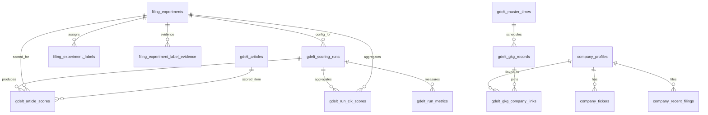
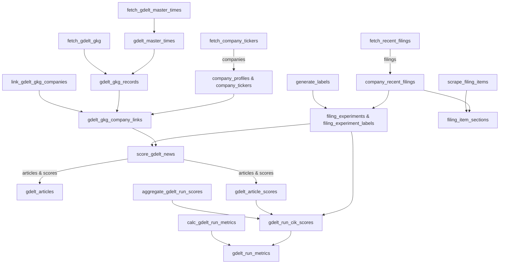

# Data Model and Pipeline Flow

This document describes how ED-Alpha stores pipeline outputs and how data moves through the batch jobs.

- **Entity Relationship Diagram** shows how ED-Alpha stores company filings, GDELT news, experiment labels, LLM scores, rankings, and evaluation metrics.
- **Batch Pipeline Flow** connects the database relationships to the batch script order, so the full data path is visible from ingestion to metrics.

## Entity Relationship Diagram

This diagram summarizes the database shape and how records connect.

## Batch Pipeline Flow

This diagram shows the batch execution order from ingestion to evaluation.

